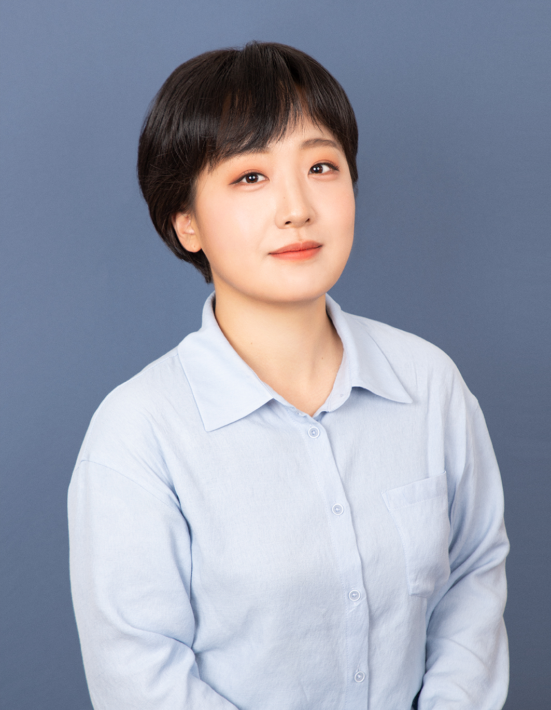
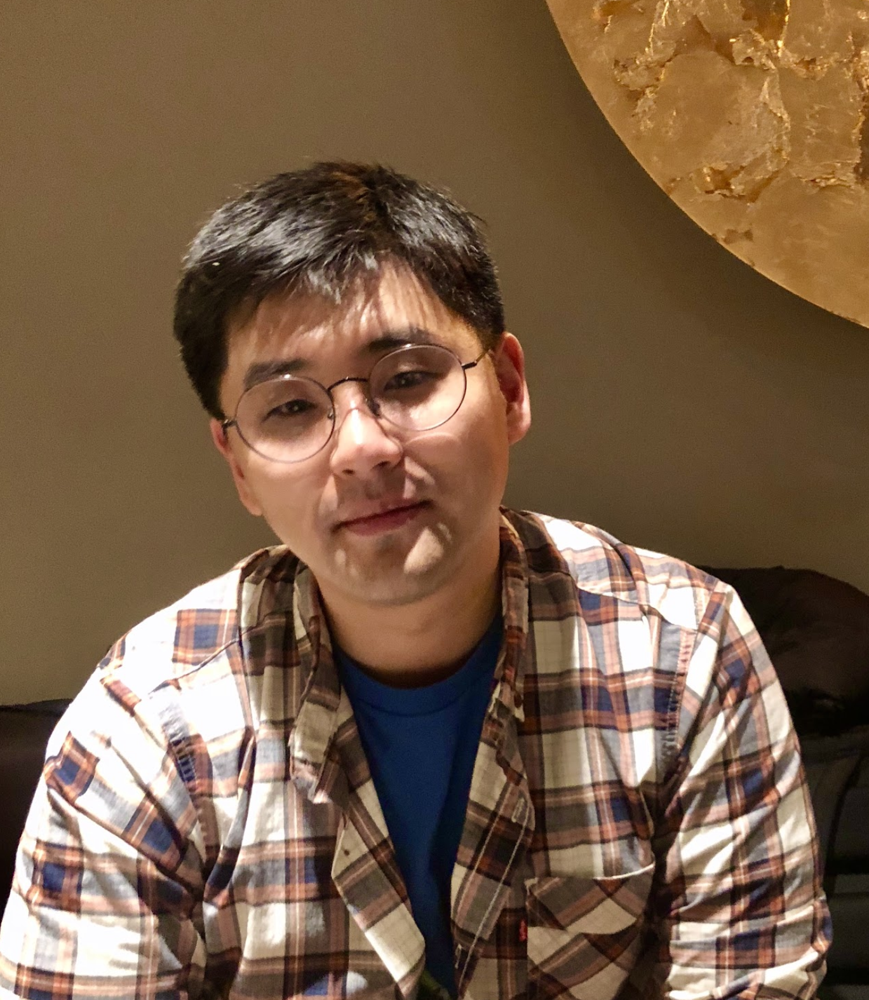
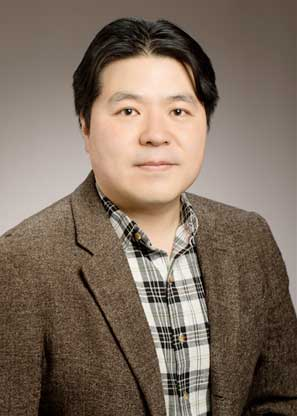
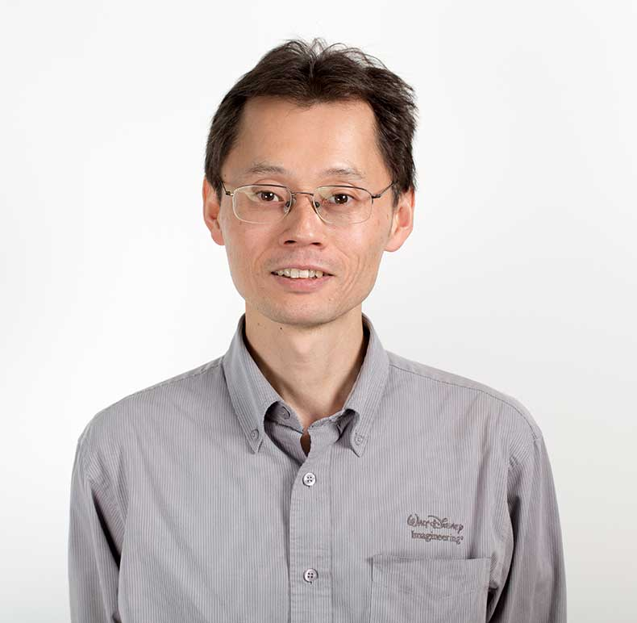

**“Natural motion is Good motion”** would be the idea that many researchers would agree with. However, compared to the vast and diverse studies to realize naturalness in agent or robot motion, the active discussion towards natural motion generation seems insufficient. Perhaps, researchers would give different answers to the question of what natural motion is. 

Therefore, from this workshop, we would like to provide a forum for researchers who have worked or are interested in "natural motion generation" across various fields from industry and academia. 

In this workshop, researchers from various backgrounds (i.e., graphics, virtual human, robotics, humanoids, legged robot, manipulator, human-robot interaction) will share and discuss attempts they have made for natural motion generation. 

In addition, we would review and reinvestigate fundamental questions about “natural motion” as below:

- How can we define the “naturalness” in motion?
    - Is Animal/Human-like motion all we need, or what else?
- What would be the benefit from “natural motion”?
    - Does "naturalness" help in both task-oriented and task-agnostic motion generation? 
- Which factor affects the “naturalness” of motion?
    - Mechanical design of a robot, Human-likeness, Context-awareness of the motion, or what else?

### Topics
We consider various topics of natural motion generation as below, but not limited to:
- Task-oriented natural motion generation:
    - Natural motion for object grasping or manipulation.
    - Natural motion for locomotion.
- Task-agnostic natural motion generation:
    - Natural motion for gesture or expression.
    - Natural motion for interaction with humans.
- Bio-inspired/Human-inspired natural motion.
- Fundamental questions for natural motion
    - What is it, Why do we need it, When do we need it, and How can we make and use it.
- Mechanical design for natural motion.
- Advanced algorithms for natural motion. 

### Invited Speakers
* Libin Liu (Peking University, China)
* Eiichi Yoshida (Tokyo University of Science, Japan)
* Jungdam Won (Seoul National University, Korea), (*Tentative)
* Daniele Pucci (Italiano di Technologia, Italy)
* Sungjoon Choi (Korea University, Korea)

### Program
<table width="100%">
  <tr>
    <td width="50%" style="text-align: center; vertical-align: left;"> <b>Korean Time (UTC+09:00)</b></td>
    <td width="50%" style="text-align: center; vertical-align: left;"> <b>Schedule</b></td>
  </tr>  
  <tr>
    <td width="50%" style="text-align: center; vertical-align: left;"> 09:30 ~ 09:40 </td>
    <td width="50%" style="text-align: center; vertical-align: left;"> Opening </td>
  </tr>  
  <tr>
    <td width="50%" style="text-align: center; vertical-align: left;"> 09:40 ~ 10:10 </td>
    <td width="50%" style="text-align: center; vertical-align: left;"> Invited Talk 1 </td>
  </tr>  
  <tr>
    <td width="50%" style="text-align: center; vertical-align: left;"> 10:10 ~ 10:40 </td>
    <td width="50%" style="text-align: center; vertical-align: left;"> Invited Talk 2 </td>
  </tr>  
  <tr>
    <td width="50%" style="text-align: center; vertical-align: left;"> 10:40 ~ 11:00 </td>
    <td width="50%" style="text-align: center; vertical-align: left;"> Coffee Break </td>
  </tr>  
  <tr>
    <td width="50%" style="text-align: center; vertical-align: left;"> 11:00 ~ 11:30 </td>
    <td width="50%" style="text-align: center; vertical-align: left;"> Invited Talk 3 </td>
  </tr>  
  <tr>
    <td width="50%" style="text-align: center; vertical-align: left;"> 11:30 ~ 12:00 </td>
    <td width="50%" style="text-align: center; vertical-align: left;"> Invited Talk 4 </td>
  </tr>  
  <tr>
    <td width="50%" style="text-align: center; vertical-align: left;"> 12:00 ~ 13:30 </td>
    <td width="50%" style="text-align: center; vertical-align: left;"> Lunch </td>
  </tr> 
  <tr>
    <td width="50%" style="text-align: center; vertical-align: left;"> 13:30 ~ 14:00 </td>
    <td width="50%" style="text-align: center; vertical-align: left;"> Invited Talk 5 </td>
  </tr> 
  <tr>
    <td width="50%" style="text-align: center; vertical-align: left;"> 14:00 ~ 14:30 </td>
    <td width="50%" style="text-align: center; vertical-align: left;"> Invited Talk 6 </td>
  </tr> 
  <tr>
    <td width="50%" style="text-align: center; vertical-align: left;"> 14:30 ~ 14:50 </td>
    <td width="50%" style="text-align: center; vertical-align: left;"> Coffee Break </td>
  </tr>
  <tr>
    <td width="50%" style="text-align: center; vertical-align: left;"> 14:50 ~ 15:20 </td>
    <td width="50%" style="text-align: center; vertical-align: left;"> Invited Talk 7 </td>
  </tr>
  <tr>
    <td width="50%" style="text-align: center; vertical-align: left;"> 15:20 ~ 15:50 </td>
    <td width="50%" style="text-align: center; vertical-align: left;"> Invited Talk 8 </td>
  </tr>
  <tr>
    <td width="50%" style="text-align: center; vertical-align: left;"> 15:50 ~ 16:20 </td>
    <td width="50%" style="text-align: center; vertical-align: left;"> Invited Talk 9 </td>
  </tr>
  <tr>
    <td width="50%" style="text-align: center; vertical-align: left;"> 16:20 ~ 16:50 </td>
    <td width="50%" style="text-align: center; vertical-align: left;"> Panel Discussion </td>
  </tr>
  <tr>
    <td width="50%" style="text-align: center; vertical-align: left;"> 16:50 ~ 17:00 </td>
    <td width="50%" style="text-align: center; vertical-align: left;"> Closing </td>
  </tr>
</table>

### Workshop Date
- **10th or 14th July 2023**

### Organizers 
* Hyemin Ahn (UNIST, Korea)
<table width="100%">
  <tr>
    <td width="30%"> </td>
    <td width="70%" style="text-align: center; vertical-align: left;"> Hyemin Ahn(she/her) is currently an Assistant Professor of Artificial Intelligence Graduate School at Ulsan National Institute of Science and Technology (UNIST). Before joining UNIST, she was a postdoctoral researcher at Technical University of Munich in 2020, and at German Aerospace Center in 2021 (PI: Dongheui Lee). She received her Ph.D. degree in Electrical Computer Engineering at Seoul National University in Seoul, Korea (advisor: Songhwai Oh). Before that, she received her Bachelor's degree in Electrical Engineering and Computer Sciences at Seoul National University. Her research interest is in machine learning-based human-robot interaction, vision and language perception, and motion generation.   [webpage](https://hyeminahn.oopy.io) </td>
  </tr>
</table>
 
* Sungjoon Choi (Korea University, Korea)
<table width="100%">
  <tr>
    <td width="30%"> </td>
    <td width="70%" style="text-align: center; vertical-align: left;"> Sungjoon Choi is currently an Assistant Professor of Department of Artificial Intelligence at Korea University. Before joining Korea University, he was a postdoctoral researcher at Disney Research, Los Angeles, from 2018-2020 and a research scientist at Kakao Brain, Korea, in 2018. He received his Ph.D. degree in Electrical Computer Engineering at Seoul National University in Seoul, Korea, advised by Songhwai Oh. Before that, he received his Bachelor's degree in Electrical Engineering and Computer Sciences at Seoul National University. During his undergraduate years, He worked at Hanool Robotics in Bucheon, Korea, as a software engineer for three years. His research interests include, but are not limited to, the following areas: human-robot interaction (HRI), robotic applications from free-from text, and physically-plausible conditional motion synthesis.   [webpage](https://sites.google.com/view/sungjoon-choi/home)
</td>
  </tr>
</table>
 
* Joohyung Kim (University of Illinois Urbana-Champaign, USA)
<table width="100%">
  <tr>
    <td width="30%"></td>
    <td width="70%" style="text-align: center; vertical-align: left;"> Joohyung Kim is currently an Associate Professor of Electrical and Computer Engineering at the University of Illinois Urbana-Champaign. His research focuses on design and control for humanoid robots, systems for motion learning in robot hardware, and safe human-robot interaction. He received BSE and Ph.D. degrees in Electrical Engineering and Computer Science (EECS) from Seoul National University, Korea, in 2001 and 2012. He was a Research Scientist in Disney Research from 2013 to 2019. Prior to joining Disney, he was a postdoctoral fellow in the Robotics Institute at Carnegie Mellon University for the DARPA Robotics Challenge in 2013. From 2009 to 2012, he was a Research Staff Member in Samsung Advanced Institute of Technology, Korea, developing biped walking controllers for humanoid robots.   [webpage](https://publish.illinois.edu/kimlab2020/) </td>
  </tr>
</table>
 
* Katsu Yamane (Path Robotics, USA)
<table width="100%">
  <tr>
    <td width="30%"></td>
    <td width="70%" style="text-align: center; vertical-align: left;"> Dr. Katsu Yamane is a Principal Research Scientist at Path Robotics Inc. He received his B.S., M.S., and Ph.D. degrees in Mechanical Engineering in 1997, 1999, and 2002 respectively from the University of Tokyo, Japan. Prior to joining Path Robotics in 2022, he held research scientist positions at Bosch Research North America, Honda Research Institute USA, and Disney Research, Pittsburgh. He was also an Associate Professor at the University of Tokyo, and a postdoctoral fellow at Carnegie Mellon University. While his current research focuses on manipulation planning and control for manufacturing, he is still passionate about humanoid robot control and motion synthesis, physical human-robot interaction, character animation, and human motion simulation.   [webpage](https://katsuyamane.com) </td>
  </tr>
</table>

### Contact
[Hyemin Ahn, UNIST](mailto:hyemin.ahn@unist.ac.kr)
